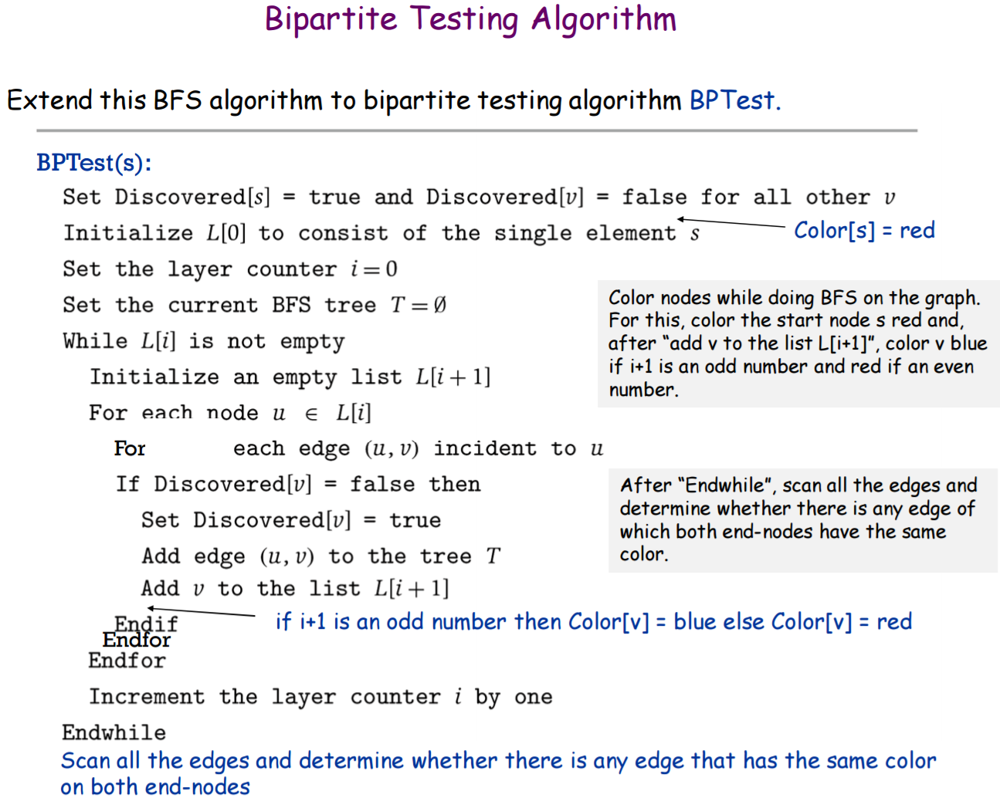

# Bipartite Graph Testing Algorithm
Modification of **Breadth First Serach** to check if a graph is **bipartite**  
Uses the same BFS approach as I use in [BFS/DFS Algorithms](https://github.com/SleekPanther/breadth-first-search-depth-first-search-graphs)

## Bipartite Graphs
A bipartite graph is one that can be partitioned into 2 sets of vertices where **no edge has both end-nodes in the same set**  
A helpful abstraction is to imagine coloring the vertices 1 of 2 colors so that **every edge has end-nodes of different colors**  

### This is the 1st graph tested in the code

An important property of Bipartite graphs is they **contain NO odd-length cycle**  
**A Bipartite Graph (even length cycle)**  

**A Non-Bipartite Graph (odd length cycle CANNOT be colored & still maintain edges with different colored end-nodes)**

### This is the 2nd graph that the code tests
  

## Algorithm
- Modification of Breadth First Search
- Explore from any arbitrary node
- Color all nodes in a layer of BFS **Red** if if layer number is even, **Blue** if odd
- Scan edges to see if any edge with the same color on both ends (return false if that's the case)

## Code Notes
- Uses an **adjacency list** graph representation
- `String[] color` is calculated during BFS based on if `layerCounter` is even or odd
