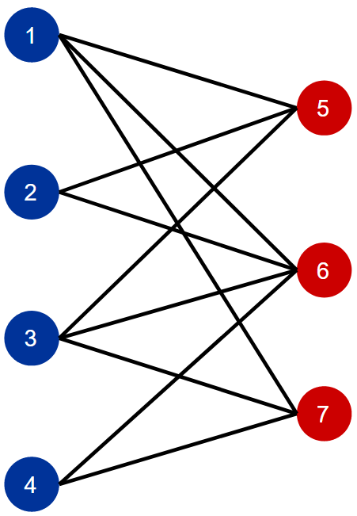
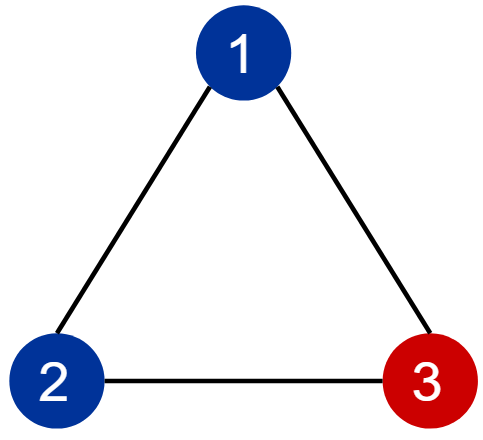

# Bipartite Graph Testing Algorithm
Modification of **Breadth First Serach** to check if a graph is **bipartite**

## Bipartite Graphs
A bipartite graph is one that can be partitioned into 2 sets of vertices where **no edge has both end-nodes in the same set**  
A helpful abstraction is to imagine coloring the vertices 1 of 2 colors so that **every edge has end-nodes of different colors**  
  
An important property of Bipartite graphs is they **contain NO odd-length cycle**  
**A Bipartite Graph (even length cycle)**  
  
**A Non-Bipartite Graph (odd length cycle CANNOT be colored & still maintain edges with different colored end-nodes)**  

## Algorithm
- Modification of Breadth First Search
- Explore from any arbitrary node
- Color all nodes in a layer of BFS 1 color if layer number is even, other color if odd
- Scan edges to see if any edge with the same color on both ends (would return false)
